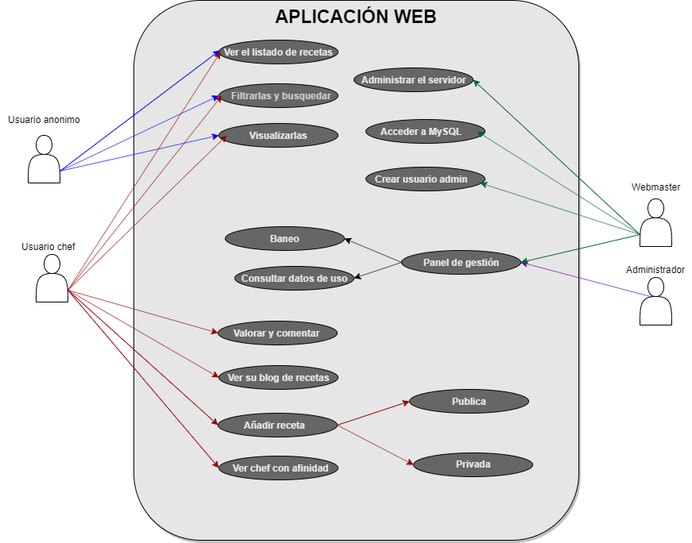
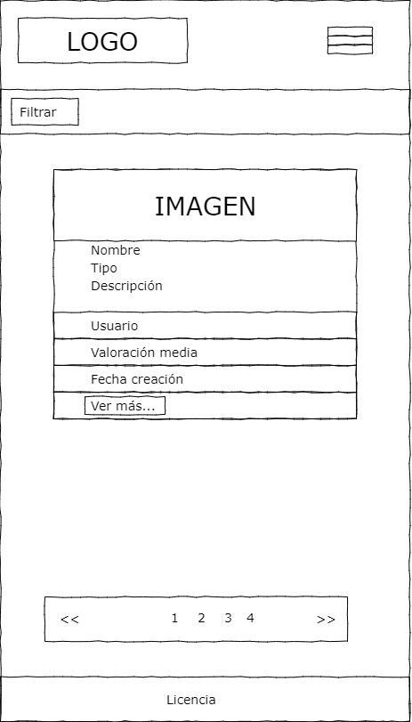

# Diseño

## Modelo conceptual del dominio de la aplicación

- Modelo Vista Controlador

- Diagrama UML

## Casos de uso

- Usuario anonimo, tiene acceso a:
	+ Ver el listado de recetas
	+ Poder filtrarlas y hacer busqueda
	+ Visualizarlas.
- Usuario chef, tiene acceso a:
	+ Acceso a lo mismo que el usuario anonimo
	+ Valorar y comentar
	+ Ver su blog de recetas
	+ Añadir receta, tiene dos estados
		* Publico
		* Privado
	+ Ver otros chefs con afinidad
- Usuario administrador
	+ Funciones propias para gestionar la app
	+ No tiene acceso a lo mismo que el usuario anonimo y el usuario chef
- Webmaster
    + Administrar el servidor
    + Acceder a MySQL
    + Crear usuario administrador

## Deseño de interface de usuarios 

Los mockups presentados a continuación no representan el resultado final de la vista, si no más bien es una aproximación pues cuando se implemente puede variar algunos pequeños detalles.

- Vista para ordenadores:
	+ Inicio

	
	+ Perfil del usuario

	
	+ Datos personales

	
	
	+ Cambio de contraseña

	

	+ Blog

	

	+ Crear receta

	

	+ Busacar, cuando esta haciondo la busqueda

	
	+ Buscar, cuando no encuentra resultados

	
- Vista para movil
	+ Inicio

	
	+ Filtro

	
	+ Desplegando el menú

	
	+ Buscar una receta
	+ Busqueda sin resultado

	

## Diagrama de la Base de Datos.

- Modelo Entidad/Relación

