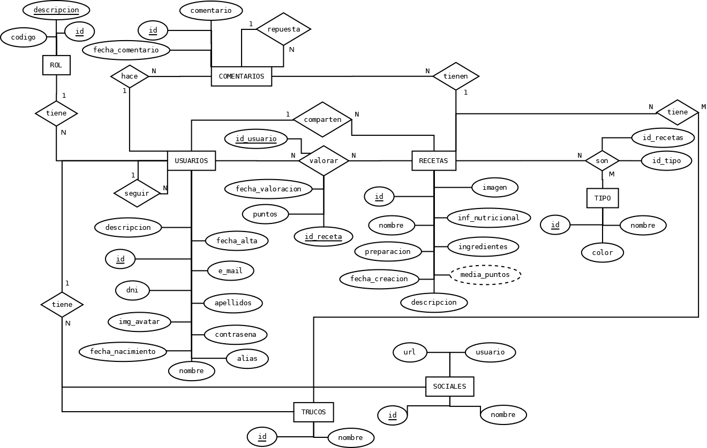

# Deseño

Unha vez realizada a fase de análise, debemos ter como resultado un listado de tarefas ou funcións a implementar. Nesta fase, debemos deseñar os algoritmos para implementar cada unha das funcións (cun diagrama ou pseudocódigo). Isto soamente debería ser necesario para funcións ou tarefas complexas que requiran de pasos máis pequenos para a súa implementación.

Unha vez realices esta fase, remata de completar o último anexo: Orzamento.

## Modelo conceptual do dominio da aplicación
Pode ser un diagrama de clases usando UML, ConML, ou outra linguaxe semellante.

## Casos de uso
Descritos en fichas e/ou mediante esquemas; deben incluír o(s) tipo(s) de usuario implicados en cada caso de uso.

## Deseño de interface de usuarios
Unha forma de axudar ó deseño da aplicación é realizar uns mockups: pódelos facer á man ou cunha aplicación ou a través dunha web do estilo: https://app.diagrams.net/

Os mockups deben incluir todas as vistas da aplicación, é dicir, todas as páxinas diferentes que un usuario (de calquera tipo) vai a poder ver. Un mockup permite ver como se verá unha páxina concreta da nosa aplicación web. O deseño de mockups vainos axudar a:

- Avanzar moi rápido na parte frontend: ao ter os mockups realizados, xa sabemos que elementos vai ter cada vista e onde colocalos. Podes empregar un framework CSS ou programar as follas de estilos.
- Visualizar a información que vai a ser necesaria mostrar. Sabendo con que información imos traballar e sabendo a información que necesitamos mostrar ao usuarios, podemos organizar os datos dunha forma axeitada para gardalos na base de datos. 

## Diagrama de Base de Datos.
Nesta fase tamén teremos que realizar:

- Modelo Entidade/relación 
- Modelo relacional 

Poderedes entregar a captura do phpMyAdmin se empregades MariaDB como Modelo relacional.

> 